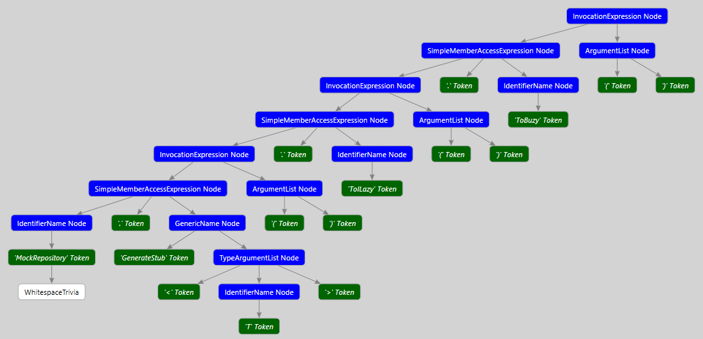

# Code patterns

| No | Source | Target | Comment |
| --- | --- | --- | --- |
| 1 | Using Rhino.Mocks; | using NSubstitute; | |
| 3 | MockRepository.GenerateStub<T>(); | Substitute.For<T>() |  |
| 3a | MockRepository.GenerateStub<T>().ToILazy(); | Substitute.For<T>() |  |
| 3b | MockRepository.GenerateStub<T>().With(U); | Substitute.For<T>().ToLazy() |  |
| 3- | MockRepository.GenerateStub<T>().ToILazy().ToBuzy(); | Substitute.For<T>().ToILazy().ToBuzy() |  |
|  |  |  |  |
|  |  |  |  |
|  |  |  |  |
|  |  |  |  |
|  |  |  |  |
|  |  |  |  |
|  |  |  |  |
|  |  |  |  |
|  |  |  |  |
|  |  |  |  |
|  |  |  |  |

## 3. GenerateStub

With ILazy

With more trails (example):

