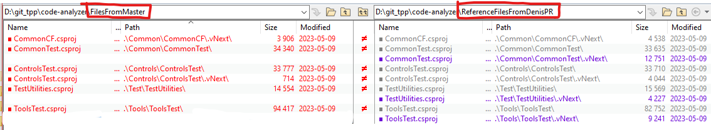

# Work

## Project diffs Ref <-> Master

| No | Project | master?  | Comment | Progress |
| --- | --- | --- | --- | --- |
| 1 | .vNext/CommonCF | Yes |  | 0% |
| 2 | CommonTest | Yes |  | 0% |
| 3 | .vNext/CommonTest | __No__ |  | 0% |
| 4 | ControlsTest | Yes |  | 0% |
| 5 | .vNext/ControlsTest | Yes |  | 0% |
| 6 | TestUtilities | Yes |  | 0% |
| 7 | .vNext/TestUtilities | __No__ |  | 0% |
| 8 | ToolsTest | Yes |  | 0% |
| 9 | .vNext/ToolsTest | __No__ |  | 0% |

## 1. CommonCF (.vNext)

## 2. CommonTest

## 3. CommonTest (.vNext)

## 4. ControlsTest

## 5. ControlsTest (.vNext)

## 6. TestUtilities

## 7. TestUtilities (.vNext)

## 8. ToolsTest

## 9. ToolsTest (.vNext)

